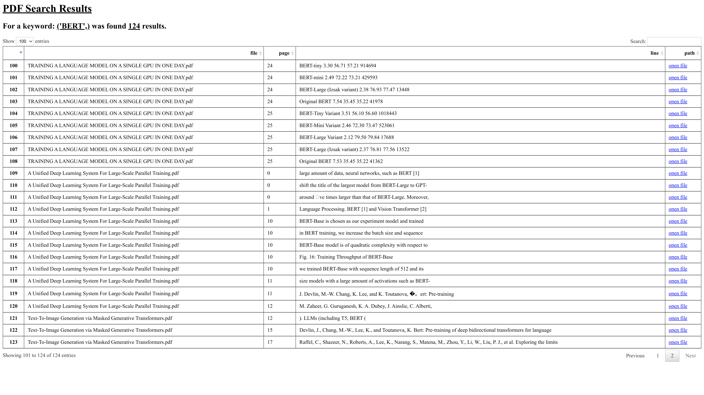
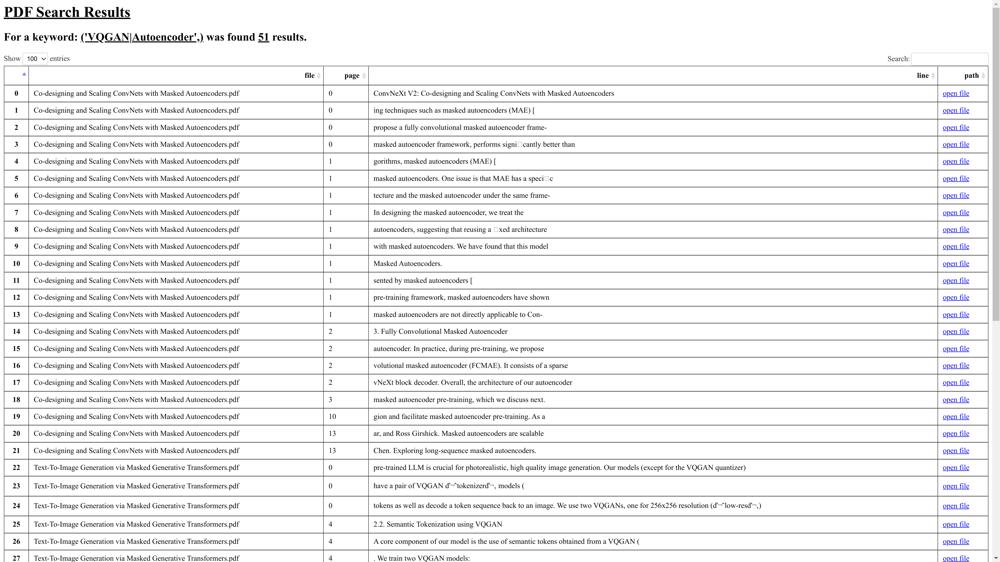

# Search keywords in multiple PDFs.
Hello and welcome. 

In this repository, you can find a Python-based tool for keywords search in multiple PDFs. 

The tool can locate and list all PFDs in a predefined folder and its subfolders. As an output, it generates a structured HTML table that contains PDF names, lines, and pages where the keyword was found. The tool also outputs a logfile where is possible to track the search process. Both the HTML table and logfile are generated into a predefined folder for keywords search. 

On the Linux platform, the tool is able to run parallelly on all CPU cores.

## Project Structure
    .
    ├── exports                     # Indicative results
    Dockerfile                      # Docker image build configuration
    LICENSE
    README.md
    docker-compose.yaml             # Docker image configuration
    logger_conf.yaml                # Configuration file for a logger
    main.py                         # Script for running the search
    requirements.txt

## Functionality
Code responsible for model keywords search is in `main.py` and once it runs, it follows this workflow:
1. Starts runtime measurement
2. Parsing the input arguments
3. Initialize logging
4. Lists all available PDFs in specified folder
5. Runs PDFs compatibility checks
6. Exclude incompatible PDFs
7. Searches for the predefined keywords in PDFs
8. Generates the report and saves it into HTML
10. Finalizes log with processing times

## Usage
You can use the tool by downloading it from the *GitHub* repository and then running the *Python* script or you can run *Docker* image. Below you can find a guide on how to do it both ways. 

### 1. Run Python Script
* Clone the repository below:

`$ git clone https://github.com/JanKorinek/20220522_Text_Search_in_PDF.git`

`$ cd 20220522_Text_Search_in_PDF`

* Setup virtual environment in *Anaconda*, *Pycharm* or in IDE you're currently using.

* Install libraries specified in `requirements.txt`

* To train the model run `main.py` and consider to use following arguments:
    * `--keyword` - (str) Keyword or phrase to search within PDFs.
    * `--folder` - (str) Target folder to search.
    * `--xCPU` - Enable/disable multiprocessing. *(Default True)*

### 2. Run Docker Image
* To use the tool via *Docker*, open the terminal and go into desired folder containing PDFs.

`$ cd <pdf_folder>`

`docker run --rm -it --name pdf_search -e TZ=Europe/Prague -v "$(pwd)":"$(pwd)" jankorinek/search_pdf:latest --folder="$(pwd)" --keyword='mlops'`

## Indicative results of the tool usage
In this section, you can see several outputs of the sample searches in the following folder structure. Screenshots are taken from the generated HTML table by the script.

    .
    ├── folder_01
        ├── TRAINING A LANGUAGE MODEL ON A SINGLE GPU IN ONE DAY.pdf
    ├── folder_02
        ├── A Unified Deep Learning System For Large-Scale Parallel Training.pdf
        ├── Text-To-Image Generation via Masked Generative Transformers.pdf
    Co-designing and Scaling ConvNets with Masked Autoencoders.pdf

### Search for "BERT" keyword

### Search for "VQGAN" and "Autoencoder" keywords at once

